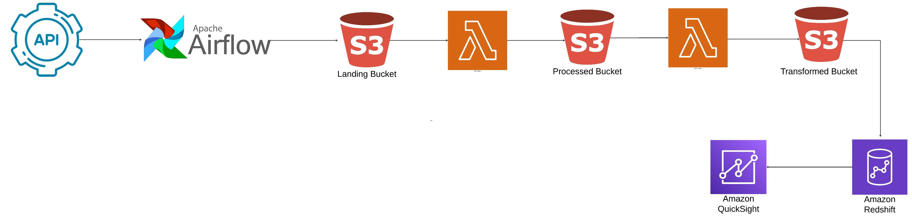

# Amazon Analytics Pipeline with Apache Airflow

## Introduction
This project dives into the world of Amazon data analytics using modern data engineering practices on AWS. I developed a data pipeline to extract, transform, and load product data from a 3rd Party API to Amazon Redshift.

Business Use Case: With this code, you can retrieve any 3rd Party Amazon Seller's catalog, have it pulled into your database, and programatically check whether your vendor has those items available.

## Architecture

