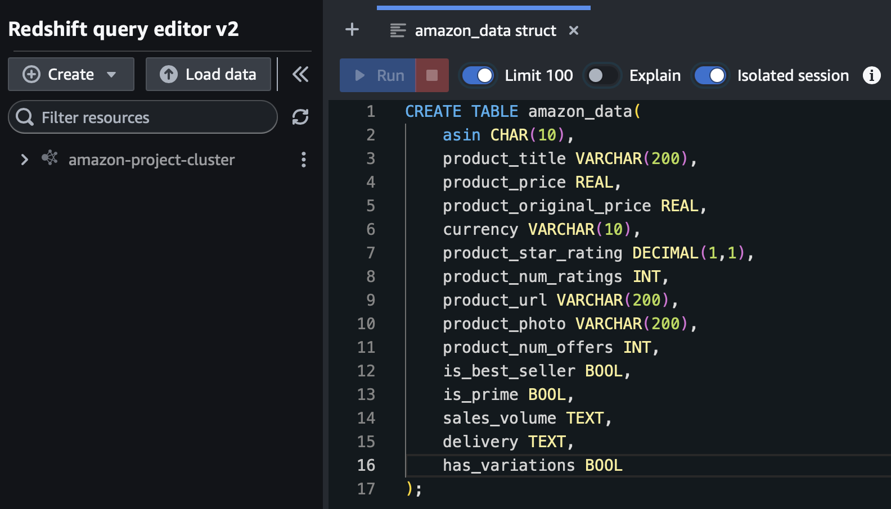

# Amazon Data Pipeline with Apache Airflow

## Introduction
This project explores Amazon data using modern data engineering practices on AWS. I developed a data pipeline to extract, transform, and load product data from a 3rd Party API into Amazon Redshift for scalable analysis.

Business Use Case: This pipeline allows you to retrieve any 3rd Party Amazon Seller's catalog, ingest it into a database, and programmatically verify whether your distributor has those products available, streamlining the sourcing process.

## Architecture

## Tech Stack
1. Python (Pipeline development & API integration)
2. SQL (Defining Redshift table structure (DDL) and stored procedures to perform joins)
3. AWS Cloud
   - EC2 (Hosts Apache Airflow instance)
   - S3 (Storage zones for incoming data)
   - Lambda (Data transformations and pushing data along the S3 buckets)
   - Redshift (Data Warehouse)
   - QuickSight (Data Visualization)
4. Apache Airflow (Orchestrates the ETL pipeline)

## Data Flow
- The pipeline calls the API, retrieving a JSON of product data from a specified seller’s catalog. The data is extracted page by page, and each page is processed individually. (Each API call results in a maximum of 48 products, therefore, adjust the "num_pages" value as needed for each storefront.)
- Then, the JSON is sent to the first S3 bucket via the BashOperator in the "load_to_s3" task.
- Triggered by the insertion into the first S3 bucket, the "copyRawJsonFile-LambdaFunction" script moves that JSON into the next S3 bucket with a copy_object command.
- The "transformation-convert-to-csv-lamdaFunction" waits for the object to exist in the second S3 bucket, and then performs data cleaning, specifies columns to include, converts the JSON into a CSV, and uploads the object into the final S3 bucket.
- Airflow task "is_file_in_s3_available" uses the S3KeySensor operator to check whether the CSV exists in the final S3 bucket every 5 seconds. (timeout is set to 60 seconds but can be adjusted as needed)
- Airflow task "transfer_s3_to_redshift" uses the S3ToRedshiftOperator to load the CSV into the data warehouse, Redshift.

## Table Structure

