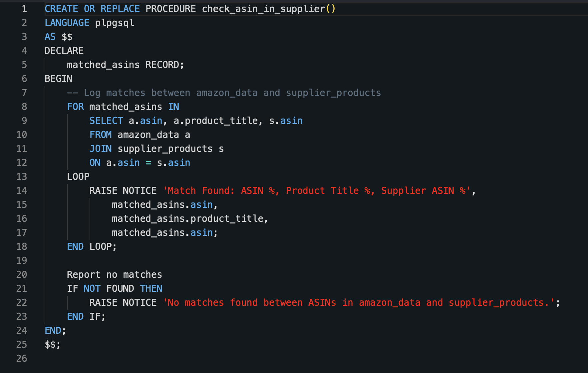

# Amazon Data Pipeline with Apache Airflow

## Introduction
This project demonstrates the use of modern data engineering practices to analyze Amazon data using AWS services. I developed a robust ETL (Extract, Transform, Load) pipeline that ingests product data from a third-party API and loads it into Amazon Redshift, enabling scalable analysis and streamlined decision-making.

Business Use Case: This pipeline allows businesses to extract any Amazon Seller's catalog, ingest the data into a database, and programmatically verify product availability with distributors. By automating and optimizing this process, the pipeline saves significant time and effort in sourcing profitable products.

All of the code can be found in the files provided in this repository. If you have any questions or need help using this pipeline, let me know!

## Architecture

## Tech Stack
1. Python (Pipeline development & API integration)
2. SQL (Defining Redshift table structure (DDL) and stored procedures to perform joins)
3. AWS Cloud
   - EC2 (Hosts Apache Airflow instance)
   - S3 (Storage zones for incoming data)
   - Lambda (Data transformations and pushing data along the S3 buckets)
   - Redshift (Data Warehouse)
4. Apache Airflow (Orchestrates the ETL pipeline)

## Prequisites
- Your distributor’s product catalog should include an ASIN column for matching against the retrieved data. This can be achieved using the same third-party API under the ASIN-to-GTIN endpoint.

## Data Flow
- The pipeline calls the API, retrieving a JSON of product data from a specified seller’s catalog. The data is extracted page by page, and each page is processed individually. (Each API call results in a maximum of 48 products, therefore, adjust the "num_pages" value as needed for each storefront.)
- Then, the JSON is sent to the first S3 bucket via the BashOperator in the "load_to_s3" task.
- Triggered by the insertion into the first S3 bucket, the "copyRawJsonFile-LambdaFunction" script moves that JSON into the next S3 bucket with a copy_object command.
- The "transformation-convert-to-csv-lamdaFunction" waits for the object to exist in the second S3 bucket, and then performs data cleaning, specifies columns to include, converts the JSON into a CSV, and uploads the object into the final S3 bucket.
- Airflow task "is_file_in_s3_available" uses the S3KeySensor operator to check whether the CSV exists in the final S3 bucket every 5 seconds. (timeout is set to 60 seconds but can be adjusted as needed)
- Airflow task "transfer_s3_to_redshift" uses the S3ToRedshiftOperator to load the CSV into the data warehouse, Redshift.

## Table Structure

## Stored Procedure

This stored procedure performs joins on the ASIN field, dynamically verifying the availability of products with distributors. It automates matching tasks that would otherwise require manual intervention, saving over 40 hours per week in product sourcing efforts.

## What's Next:

- I will implement advanced analytics dashboards using Amazon Quicksight to show which third-party sellers have the highest number of ASIN matches, which distributors have the highest number of ASIN matches, and which ASINs are the best-sellers and most profitable.
- Expand the pipeline to support real-time data ingestion for faster decision-making, using Kafka.
- Use Docker to containerize the pipeline components, ensuring consistent deployment across different environments. This will simplify the setup process, improve scalability, and enable integration with Kubernetes for orchestration.
- Automate reporting and notifications to alert about changes in product availability, pricing, or demand trends.
